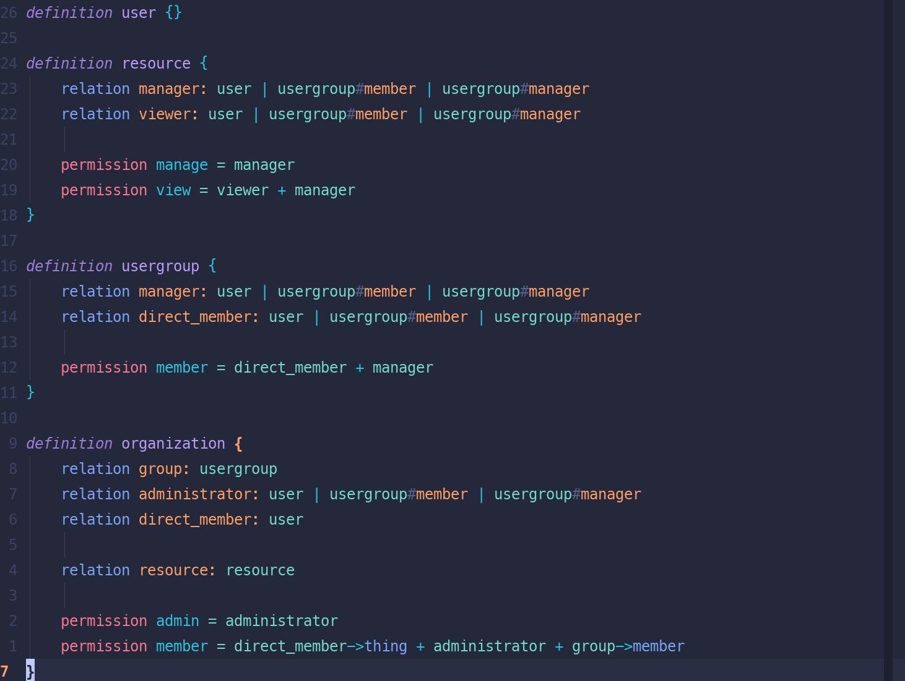

# tree-sitter-authzed

## Usage with Neovim

DISCLAIMER: until I can package this appropriately this is how I currently have it setup

Copy queries/highlights.scm to ~/.config/nvim/queries/authzed/highlights.scm or create your own

add this to your neovim config for treesitter

```
local parser_config = require("nvim-treesitter.parsers").get_parser_configs()
parser_config.authzed = {
        install_info = {
                url = "https://github.com/mleonidas/tree-sitter-authzed", -- local path or git repo
                files = { "src/parser.c" },
                generate_requires_npm = false,
                requires_generate_from_grammar = false,
                -- optional entries:
                branch = "main", -- default branch in case of git repo if different from master
        },
        filetype = "authzed", -- if filetype does not match the parser name
}
```
Refresh your neovim instance and run `:TsInstall authzed`
Setup an autogroup for the file extension of your choice

```
augroup Authzed
  au!
  autocmd BufNewFile,BufRead *.authzed set ft=authzed
  autocmd BufNewFile,BufRead *.zed set ft=authzed
  autocmd BufNewFile,BufRead *.azd set ft=authzed
augroup END
```
Hopefully once I package this appropriately and create a vim plugin all of this will be automatic
You can also find a refrence to my neovim configuration in my dotfiles repo


## Example of the highlights

